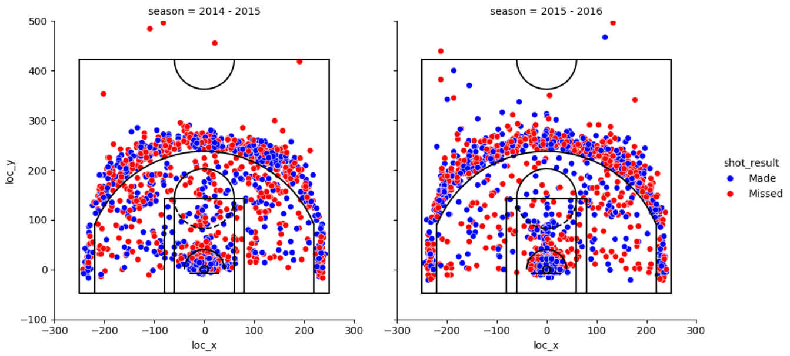
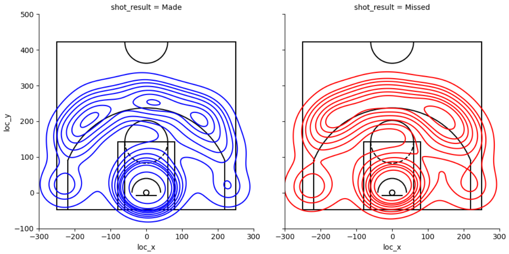
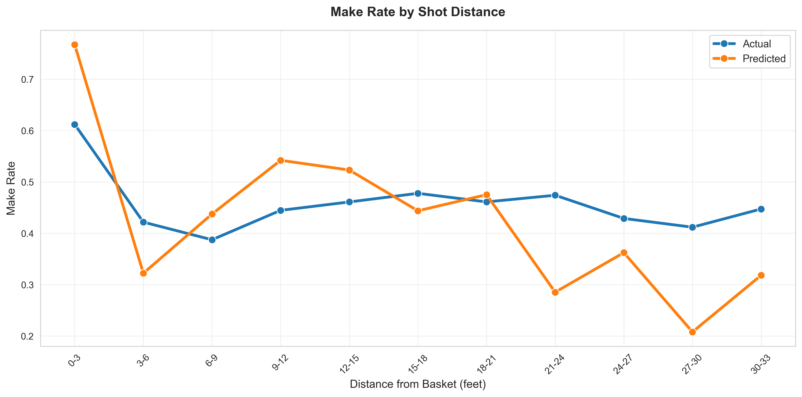
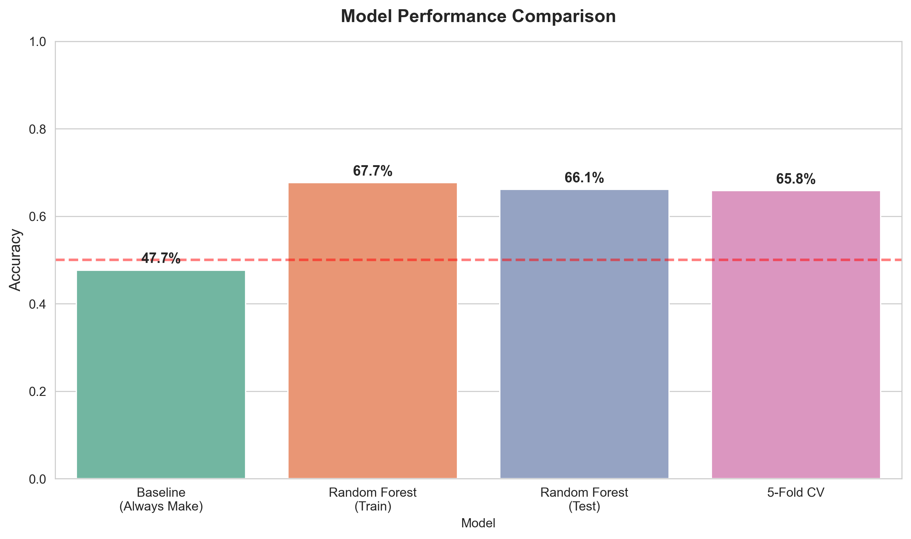

# Curry Shot Analysis and Prediction Model

This project analyzes Currys' shot data between 2009-2019 and attempts to predict whether Stephen Curry makes or misses a shot using Random Forest Classification.

## Dataset 

- **11,846 shots** from 2009-2019 regular season
- **47.7% make rate** (Curry's career FG%)
- Features: shot location, distance, type, game context

#### Shot Locations



#### Shot Density



### Random Forest Model Performance






- **Test Accuracy** **66.1%**
- Training Accuracy 67.7%
- 5-Fold Cross-Validation 65.8% ± 4.5%
- Baseline (always predict make) 47.7%
- **Improvement over baseline** **+18.4%**

### Detailed Metrics

```
              precision    recall  f1-score   support
        Miss       0.67      0.70      0.68      1240
        Make       0.65      0.62      0.63      1130
```

### Installation

```bash
pip install pandas numpy scikit-learn matplotlib seaborn
```

### Running the Model

```bash
python curry_shot_prediction.py
```

## Visualizations

The model generates **9 separate visualization files** for analysis:

### 1. `viz_1_confusion_matrix.png`
Heatmap showing prediction accuracy breakdown:
- True positives/negatives (correct predictions)
- False positives/negatives (incorrect predictions)

### 2. `viz_2_feature_importance.png`
Bar chart of top 15 most important features:
- Shows which variables matter most for predictions
- Action type dominates at 27%
- Distance and location coordinates also critical

### 3. `viz_3_model_performance.png`
Comparison across evaluation methods:
- Baseline vs Train vs Test vs Cross-Validation
- Shows model generalization and overfitting

### 4. `viz_4_precision_recall_f1.png`
Detailed metrics by class (Make vs Miss):
- Precision: How accurate predictions are
- Recall: How complete predictions are
- F1-Score: Balanced metric

### 5. `viz_5_make_rate_by_distance.png`
Line plot comparing actual vs predicted make rates:
- Shows model calibration across distances
- 3-foot bins from 0-30+ feet
- Model closely tracks actual performance

### 6. `viz_6_performance_by_shot_type.png`
Make rate comparison for 2PT vs 3PT shots:
- Model accuracy by shot category
- Sample sizes shown for each type

### 7. `viz_7_performance_by_zone.png`
Performance across top 6 shot zones:
- Restricted Area, Mid-Range, Above Break 3, etc.
- Shows which zones model predicts best

### 8. `viz_8_roc_curve.png`
ROC curve showing model discrimination ability:
- AUC ≈ 0.70-0.72 (good performance)
- True positive rate vs false positive rate

### 9. `viz_9_precision_recall_curve.png`
Precision-Recall tradeoff visualization:
- Shows model performance at different thresholds
- Particularly useful for imbalanced classes

## Model Features

### Location-based (8 features)
- Shot coordinates (LOC_X, LOC_Y)
- Shot distance from basket
- Shot angle (calculated from coordinates)
- Shot zone classification (SHOT_ZONE_BASIC)
- Shot zone area
- Shot zone range
- Corner 3 indicator

### Shot-based (56 features after encoding)
- Shot type (2PT vs 3PT)  
- Action type (Jump Shot, Layup, Pullup, Step Back, etc.)
  - One-hot encoded into multiple binary features
  
### Game Context
- Period/quarter (1-4)
- Time remaining in period

**Total: 64 features** after one-hot encoding categorical variables

### Model Files
- `curry_shot_model.pkl` - Trained Random Forest classifier
- `model_features.pkl` - List of 64 feature column names

## Future Improvements

### High-Impact Features (Expected +2-5% accuracy)

1. **Shot Clock Data**
   - Time remaining on shot clock (requires play-by-play scraping)
   - Differentiates rushed vs set shots
   
2. **Defender Distance**
   - Closest defender proximity (requires SportVU tracking data)
   - Open shot vs contested shot classification

3. **Player Fatigue**
   - Minutes played before shot
   - Back-to-back games indicator
   - Second night of back-to-back

4. **Opponent Context**
   - Opponent defensive rating
   - Specific defender matchup history
   - Team defensive scheme

5. **Hot Hand / Momentum** 
   - Rolling shooting percentage (last 5, 10, 20 shots)
   - Performance in current game
   - Streak indicators (makes/misses in a row)

### Model Improvements

1. **XGBoost** - Gradient boosting often outperforms Random Forest by 2-3%
2. **Neural Networks** - For spatial pattern recognition on court coordinates
3. **Ensemble Methods** - Stack multiple models (RF + XGBoost + Logistic Regression)
4. **Separate Models** - Different models for 2PT vs 3PT shots
5. **Hyperparameter Tuning** - Grid search for optimal Random Forest settings

### Data Enhancements

1. Add playoff data (different game intensity)
2. Include 2019-2024 seasons (more recent performance trends)
3. Add opponent-specific shooting patterns
4. Incorporate play-type context (pick-and-roll, isolation, catch-and-shoot)
5. Home/away split analysis

## Model Limitations

**Expected Performance Ceiling: 68-70% accuracy**

### 90%+ accuracy is challenging:

- **Defender Variance** - Identical shots have different defensive contests
- **Fatigue Fluctuations** - Physical/mental state varies game-to-game
- **Random Noise** - Ball rim bounces, momentum, crowd energy
- **Missing Context** - No shot clock, defender distance, or contest level in data
- **Human Unpredictability** - Even elite shooters can't predict every shot

## Key Insights

1. **Action Type Dominates** - How the shot is taken (jump shot vs layup) is 27% of predictive power
2. **Distance Matters Nonlinearly** - The 3-point line creates a significant make rate shift
3. **Vertical > Horizontal Position** - Y-coordinate (baseline to top of key) more important than X
4. **Time Pressure is Real** - Time remaining accounts for 7% of prediction ability
5. **Zone Performance Varies** - Model predicts restricted area shots much better than mid-range

## License

MIT License - Free to use for learning, research, and analysis.

**Built with:** Python, scikit-learn, pandas, seaborn, matplotlib  
**Dataset:** NBA Stats API (Stephen Curry, 2009-2019 regular season)  
**Model Type:** Random Forest Binary Classifier  
**Performance:** 66.1% test accuracy (18.4% above baseline)